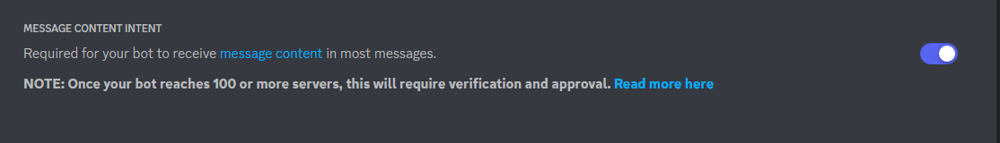

Replit : https://replit.com/@RizalNugraha5/ChatGPT-Discord-Bot-Using-OpenAi-API-Key

# ChatGPT Discord Bot Template

This template was adapted from [here](https://github.com/Zero6992/chatGPT-discord-bot) and (https://replit.com/@bardia/ChatGPT-Discord-Bot)

Reverse Engineered ChatGPT by OpenAI [here](https://github.com/acheong08/ChatGPT). 

# Setup

This assumes you have a Discord account, server and a role in that server with priviliges to set up a bot.

## Create a Discord bot

1. Go to https://discord.com/developers/applications create an application.
2. And build a bot under the application.
3. Get the token from Bot setting.
   
4. Store the token in Secrets as an environment variable with the name `DISCORD_BOT_TOKEN`
   
5. Turn MESSAGE CONTENT INTENT `ON`
   
6. Invite your bot through OAuth2 URL Generator
   

## Get your OpenAi API Key

<ol><li>Go to the OpenAI website (<a href="https://beta.openai.com/signup/" target="_new">https://beta.openai.com/signup/</a>).</li><li>Sign up for an account.</li><li>Once you've confirmed your email, log in to your OpenAI account.</li><li>Navigate to the API Keys section in your account settings.</li><li>Generate a new API key.</li></ol>

